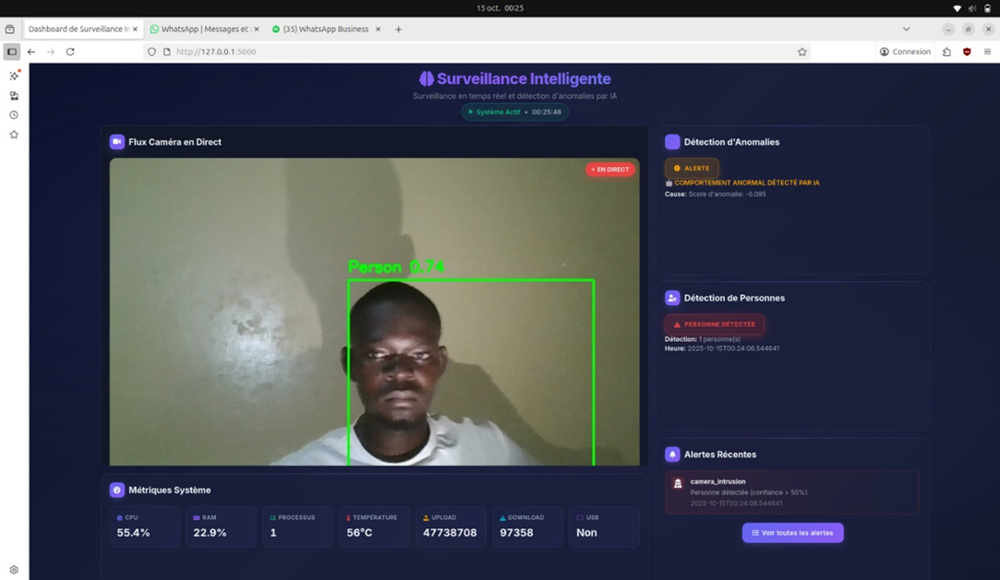
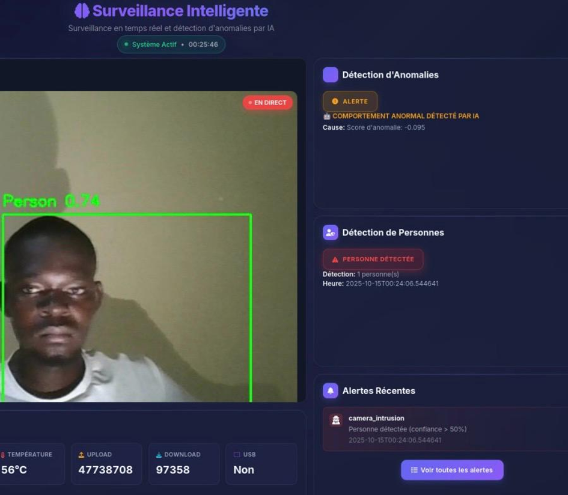
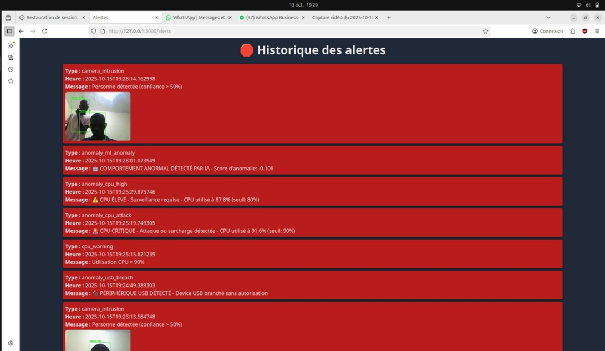

# Surveillance Intelligente du Matériel Informatique

[](https://github.com/votre-repo/surveillance-materiel)
[](https://www.python.org/downloads/)
[](LICENSE)

> Système de surveillance temps réel combinant vision par ordinateur (YOLOv8) et machine learning pour la sécurité des infrastructures informatiques académiques


---

## Aperçu du Système en Action

<div align="center">

### 🎯 Détection d'Intrusions en Temps Réel

<table>
  <tr>
    <td align="center">
      
      <br/>
      <em>Détection avec haute confiance (95%)</em>
    </td>
</table>

### ✨ Caractéristiques Visuelles
- ✅ **Bounding boxes** en temps réel avec confiance affichée
- ✅ **Capture automatique** d'images horodatées
- ✅ **Overlay d'informations** (timestamp, FPS, détections)
- ✅ **Interface moderne** avec TailwindCSS

</div>

---

## 📋 Table des Matières

- [Aperçu du Projet](#-aperçu-du-projet)
- [Fonctionnalités Principales](#-fonctionnalités-principales)
- [Architecture Technique](#-architecture-technique)
- [Prérequis](#-prérequis)
- [Installation](#-installation)
- [Configuration](#-configuration)
- [Utilisation](#-utilisation)
- [Modèles Machine Learning](#-modèles-machine-learning)
- [Système d'Alertes](#-système-dalertes)
- [Dashboard et Visualisations](#-dashboard-et-visualisations)
- [Tests et Validation](#-tests-et-validation)
- [Structure du Projet](#-structure-du-projet)
- [API Documentation](#-api-documentation)
- [Déploiement](#-déploiement)
- [Limitations et Améliorations](#-limitations-et-améliorations)
- [Contribution](#-contribution)
- [Auteurs](#-auteurs)
- [Remerciements](#-remerciements)

---

## 🎯 Aperçu du Projet

### Contexte et Problématique

Les salles de travaux pratiques (TP) informatiques dans les établissements d'enseignement supérieur sont confrontées à plusieurs défis de sécurité :

- **Intrusions physiques** non autorisées
- **Surveillance humaine** coûteuse et peu efficace
- **Détection tardive** des anomalies système
- **Usage non autorisé** ou détérioration du matériel
- **Absence de corrélation** entre événements physiques et logiciels

### Notre Solution

Un système intelligent et modulaire qui combine trois approches complémentaires :

1. **👁️ Vision par Ordinateur** - Détection d'intrusions physiques via YOLOv8
2. **🧠 Machine Learning** - Détection d'anomalies système (supervisé + non supervisé)
3. **📊 Visualisation Intelligente** - Analyse et interprétation avec Yellowbrick

### Objectifs

**Pédagogiques :**
- Maîtriser l'intégration OpenCV et scikit-learn
- Implémenter des algorithmes de détection d'anomalies
- Développer des compétences en visualisation de données
- Concevoir une architecture système temps réel

**Scientifiques :**
- Évaluer l'efficacité de YOLOv8 en environnement contrôlé
- Comparer approches supervisées vs non supervisées
- Mesurer l'impact de la qualité des données sur les performances

---

## ✨ Fonctionnalités Principales

### 🎥 Détection d'Intrusions par Vision


- **Détection temps réel** de présence humaine via YOLOv8
- **Précision de détection** > 95% (mAP50)
- **Capture automatique** d'images preuves avec timestamp
- **Flux vidéo MJPEG** avec overlay des détections
- **Gestion anti-spam** avec cooldowns intelligents
- **Format ONNX** pour inférence optimisée

**Métriques :**
- Precision: 0.964
- Recall: 0.957
- F1-Score: 0.960
- Latence: < 100ms par frame

### 📊 Surveillance Système en Temps Réel

**Métriques Collectées (toutes les 5 secondes) :**
- Utilisation CPU (%)
- Consommation mémoire (%)
- Température processeur (°C)
- Connexions réseau actives
- Nombre de processus
- Périphériques USB connectés
- Activité réseau (octets envoyés/reçus)

### 🤖 Détection d'Anomalies ML

**Approche Double :**

#### 1. Apprentissage Supervisé (Random Forest)
- Classification binaire normal/anormal
- **Précision : 95.2%**
- F1-Score : 0.94
- 8 features d'entrée

#### 2. Apprentissage Non Supervisé
- **KMeans Clustering** : Identification de 3 profils d'utilisation
- **Isolation Forest** : Détection d'outliers avec contamination 10%
- Score d'anomalie personnalisable

**Features Utilisées :**
```
1. cpu_percent          5. process_count
2. memory_percent       6. network_connections
3. temperature          7. bytes_sent
4. disk_usage          8. bytes_received
```

### 🚨 Système d'Alertes Multi-niveaux

**Hiérarchie des Sévérités :**

| Niveau | Types d'Alertes | Cooldown | Action |
|--------|----------------|----------|--------|
| 🔴 CRITICAL | Intrusion caméra, Surchauffe >80°C | 300s | Notification immédiate |
| 🟠 HIGH | Surcharge CPU >90%, Fuite mémoire | 240s | Notification prioritaire |
| 🟡 MEDIUM | Activité réseau anormale, USB non autorisé | 180s | Log et monitoring |
| 🔵 LOW | Avertissements système | 120s | Log uniquement |

**Caractéristiques :**
- Gestion intelligente des cooldowns
- Escalade automatique (1ère → 2ème → 3+ occurrences)
- Journalisation JSONL pour audit
- Sauvegarde automatique d'images preuves
- WebSocket pour notifications temps réel

### 📈 Dashboard Interactif

**Composants :**
- Flux vidéo temps réel avec détections
- Graphiques CPU, mémoire, température
- Panneau d'alertes (20 dernières)
- Historique complet (200 alertes)
- Indicateurs de statut système
- Page dédiée aux alertes avec images

**Technologies :**
- Flask + SocketIO (backend)
- TailwindCSS 2.2 (frontend)
- Chart.js (graphiques)
- Font Awesome 6.4 (icônes)

---

## 🏗️ Architecture Technique

### Stack Technologique

```
┌─────────────────────────────────────────────────────────┐
│                   FRONTEND (Web UI)                      │
│  ┌──────────────┐  ┌──────────────┐  ┌──────────────┐  │
│  │  Dashboard   │  │  Alerts View │  │ Video Stream │  │
│  │ (HTML/CSS/JS)│  │  (TailwindCSS│  │   (MJPEG)    │  │
│  └──────┬───────┘  └──────┬───────┘  └──────┬───────┘  │
└─────────┼──────────────────┼──────────────────┼──────────┘
          │                  │                  │
          └──────────────────┴──────────────────┘
                      WebSocket / HTTP
┌─────────────────────────────────────────────────────────┐
│              BACKEND (Flask Application)                 │
│  ┌──────────────────────────────────────────────────┐  │
│  │              app/main.py (Orchestrateur)         │  │
│  └───────┬────────────────────────────────┬─────────┘  │
│          │                                 │             │
│  ┌───────▼────────┐    ┌──────────────────▼────────┐  │
│  │  Vision Module │    │   ML Anomaly Detection    │  │
│  │  app/core/     │    │      app/ml/              │  │
│  │  - camera.py   │    │  - predictor.py           │  │
│  │  - YOLOv8      │    │  - Random Forest          │  │
│  └───────┬────────┘    │  - Isolation Forest       │  │
│          │             │  - KMeans                 │  │
│  ┌───────▼────────┐    └──────────────────┬────────┘  │
│  │ System Monitor │                       │             │
│  │  app/core/     │    ┌──────────────────▼────────┐  │
│  │  - psutil      │◄───┤   Alert System            │  │
│  │  - pyudev      │    │   app/core/               │  │
│  └────────────────┘    │   - alert_system.py       │  │
│                        └───────────────────────────┘  │
└─────────────────────────────────────────────────────────┘
                            │
┌───────────────────────────┴─────────────────────────────┐
│                    DATA LAYER                            │
│  ┌──────────────┐  ┌──────────────┐  ┌──────────────┐  │
│  │ Logs (JSONL) │  │ Models (.pkl)│  │ Images (.jpg)│  │
│  │ outputs/logs │  │ models/ml/   │  │ outputs/     │  │
│  └──────────────┘  └──────────────┘  │ detections/  │  │
└─────────────────────────────────────────────────────────┘
```

### Technologies Utilisées

| Composant | Technologie | Version | Usage |
|-----------|-------------|---------|-------|
| **Backend** | Python | 3.8+ | Langage principal |
| | Flask | 3.0.0 | Framework web |
| | Flask-SocketIO | 5.3.5 | Communication temps réel |
| **Vision** | OpenCV | 4.8.1 | Traitement vidéo |
| | Ultralytics YOLOv8 | 8.0.196 | Détection d'objets |
| **ML** | scikit-learn | 1.3.1 | Algorithmes ML |
| | Yellowbrick | 1.5 | Visualisations |
| **Monitoring** | psutil | 5.9.6 | Métriques système |
| | pyudev | 0.24.1 | Détection USB |
| **Frontend** | TailwindCSS | 2.2 | Styling |
| | Chart.js | 3.x | Graphiques |
| **Déploiement** | Docker | Latest | Containerisation |
| | Gunicorn | 21.2.0 | Serveur WSGI |

### Architecture des Données

```
data/
├── raw/                    # Données brutes
│   ├── donnees_ml.csv      # Métriques collectées
│   └── simulated_ml_data.csv  # Données simulées
├── processed/              # Données traitées
│   └── donnees_ml_combined.csv  # Dataset fusionné (1000 échantillons)
└── scripts/                # Scripts de traitement
    ├── combine_datasets.py
    └── generate_simulated_data.py
```

**Composition du Dataset :**
- 400 échantillons normaux (collecte réelle)
- 600 échantillons anormaux (simulation)
- 8 features normalisées (StandardScaler)
- Split 80/20 train/test

---

## 📦 Prérequis

### Matériel

- **CPU :** 4 cores minimum (Intel i5 ou AMD équivalent)
- **RAM :** 8 GB minimum (16 GB recommandé)
- **Webcam :** USB compatible V4L2 (Linux) ou DirectShow (Windows)
- **Stockage :** 5 GB d'espace disque libre
- **Réseau :** Connexion internet pour l'installation des dépendances

### Logiciels

- **OS :** Ubuntu 20.04+ (recommandé) ou Windows 10+
- **Python :** 3.8, 3.9, 3.10 ou 3.11
- **Git :** Pour cloner le repository
- **Docker :** (optionnel) Pour déploiement containerisé

### Vérification des Prérequis

```bash
# Vérifier Python
python --version  # Doit afficher Python 3.8+

# Vérifier la caméra (Linux)
ls /dev/video*  # Doit afficher /dev/video0 ou similaire

# Vérifier la caméra (Windows)
# Ouvrir l'application Caméra Windows

# Vérifier l'espace disque
df -h  # Linux
dir   # Windows
```

---

## 🚀 Installation

### 1. Cloner le Repository

```bash
# Via HTTPS
git clone https://github.com/votre-username/surveillance-materiel.git
cd surveillance-materiel

# Via SSH
git clone git@github.com:votre-username/surveillance-materiel.git
cd surveillance-materiel
```

### 2. Créer un Environnement Virtuel

```bash
# Linux/Mac
python3 -m venv venv
source venv/bin/activate

# Windows
python -m venv venv
venv\Scripts\activate
```

### 3. Installer les Dépendances

```bash
# Mettre à jour pip
pip install --upgrade pip

# Installer les dépendances
pip install -r app/requirements.txt

# Vérifier l'installation
pip list
```

**Contenu de requirements.txt :**
```txt
# Web Framework
Flask==3.0.0
flask-socketio==5.3.5
python-socketio==5.10.0
eventlet==0.33.3

# Computer Vision
opencv-python==4.8.1.78
ultralytics==8.0.196

# Machine Learning
scikit-learn==1.3.1
yellowbrick==1.5
joblib==1.3.2

# Data Processing
numpy==1.24.3
pandas==2.1.1

# System Monitoring
psutil==5.9.6
pyudev==0.24.1  # Linux uniquement

# Utilities
python-dotenv==1.0.0
PyYAML==6.0.1
```

### 4. Vérifier l'Accès à la Caméra

```bash
# Linux
ls -l /dev/video0

# Test Python
python -c "import cv2; print(cv2.VideoCapture(0).isOpened())"
# Doit afficher: True
```

### 5. Télécharger les Modèles (si nécessaire)

Les modèles entraînés sont inclus dans le repository. Si vous souhaitez les réentraîner :

```bash
# Générer les données simulées
python data/scripts/generate_simulated_data.py

# Combiner les datasets
python data/scripts/combine_datasets.py

# Entraîner les modèles ML
python app/ml/train_supervised.py
python app/ml/train_unsupervised.py
```

---

## ⚙️ Configuration

### 1. Fichier de Configuration Central

Le projet utilise un système de chemins centralisé via `config/paths.py`. Tous les chemins sont gérés automatiquement.

**Structure des chemins :**
```python
from config.paths import (
    VISION_MODEL,      # models/best.onnx
    CLASSIFIER_MODEL,  # models/ml/classifier.joblib
    ALERTS_DIR,        # outputs/alerts/
    LOGS_DIR,          # outputs/logs/
    DETECTIONS_DIR,    # outputs/detections/
)
```

### 2. Configuration de la Caméra

Modifier dans `app/main.py` ou créer un fichier `.env` :

```python
# Configuration caméra
CAMERA_DEVICE = 0  # 0 pour /dev/video0, 1 pour /dev/video1, etc.
CAMERA_WIDTH = 640
CAMERA_HEIGHT = 480
CAMERA_FPS = 30
CONFIDENCE_THRESHOLD = 0.6  # Seuil de confiance pour détections
```

### 3. Configuration des Alertes

```python
# Cooldowns (en secondes)
ALERT_COOLDOWNS = {
    'camera_intrusion': 300,    # 5 minutes
    'cpu_attack': 240,          # 4 minutes
    'memory_leak': 240,
    'thermal_emergency': 300,
    'network_intrusion': 180,   # 3 minutes
    'usb_device': 120,          # 2 minutes
}

# Seuils
CPU_THRESHOLD = 90      # %
MEMORY_THRESHOLD = 90   # %
TEMP_THRESHOLD = 80     # °C
NETWORK_THRESHOLD = 200 # connexions TCP
```

### 4. Variables d'Environnement (.env)

Créer un fichier `.env` à la racine (copier depuis `.env.example`) :

```env
# Application
FLASK_ENV=production
SECRET_KEY=votre_cle_secrete_ultra_securisee
DEBUG=False

# Caméra
CAMERA_DEVICE=0
DETECTION_CONFIDENCE=0.6

# Monitoring
MONITORING_INTERVAL=5
CPU_THRESHOLD=90
MEMORY_THRESHOLD=90
TEMP_THRESHOLD=80

# Alertes
ALERT_COOLDOWN=300
```

### 5. Configuration Docker (optionnel)

Le fichier `docker/docker-compose.yml` contient toute la configuration :

```yaml
version: '3.8'

services:
  surveillance:
    build:
      context: ..
      dockerfile: docker/Dockerfile
    ports:
      - "5000:5000"
    devices:
      - /dev/video0:/dev/video0  # Accès caméra
    volumes:
      - ../outputs:/app/outputs
      - ../models:/app/models
    environment:
      - FLASK_ENV=production
    restart: unless-stopped
```

---

## 🎮 Utilisation

### Démarrage Rapide

```bash
# Activer l'environnement virtuel
source venv/bin/activate  # Linux/Mac
venv\Scripts\activate     # Windows

# Lancer l'application
python app/main.py

# L'application démarre sur http://localhost:5000
```

**Sortie attendue :**
```
 * Serving Flask app 'main'
 * Debug mode: off
WARNING: This is a development server.
 * Running on http://127.0.0.1:5000
Press CTRL+C to quit

[INFO] Modèles ML chargés avec succès
[INFO] Caméra initialisée: /dev/video0
[INFO] Surveillance démarrée
```

### Accès au Dashboard

1. **Ouvrir un navigateur** : `http://localhost:5000`
2. **Dashboard principal** : Vue d'ensemble temps réel
3. **Page des alertes** : `http://localhost:5000/alerts`

### Démarrage en Production

```bash
# Avec Gunicorn (recommandé pour production)
gunicorn --worker-class eventlet -w 1 --bind 0.0.0.0:5000 app.main:app

# Avec Docker
cd docker
docker-compose up -d

# Vérifier les logs
docker-compose logs -f surveillance
```

### Arrêt de l'Application

```bash
# Mode développement
Ctrl + C

# Docker
docker-compose down

# Arrêt complet avec suppression des conteneurs
docker-compose down -v
```

---

## 🧠 Modèles Machine Learning

### Dataset d'Entraînement

**Office Person Dataset (Vision) :**
- Source : Roboflow
- Classes : 1 (Person)
- Images : ~1000 (train/val/test split)
- Augmentation : Rotation, flip, luminosité
- Format : YOLO format avec bounding boxes

**Métriques Système (ML) :**
- Total : 1000 échantillons
- Normal : 400 (données réelles)
- Anormal : 600 (données simulées)
- Features : 8 métriques système
- Normalisation : StandardScaler (μ=0, σ=1)

### Entraînement des Modèles

#### 1. Vision (YOLOv8)

```bash
# Le modèle est déjà entraîné et inclus : models/best.onnx
# Pour réentraîner (nécessite dataset) :
yolo train model=yolov8n.pt data=office_person.yaml epochs=100 imgsz=640
```

**Hyperparamètres YOLOv8 :**
```yaml
epochs: 100
batch_size: 16
imgsz: 640
optimizer: SGD
lr0: 0.01
momentum: 0.937
weight_decay: 0.0005
```

**Performances :**
- mAP50: 0.964
- mAP50-95: 0.847
- Precision: 0.964
- Recall: 0.957
- Vitesse inférence: ~30 FPS (CPU)

#### 2. Machine Learning (Supervisé)

```bash
python app/ml/train_supervised.py
```

**Algorithme : Random Forest Classifier**
```python
RandomForestClassifier(
    n_estimators=100,
    max_depth=10,
    min_samples_split=5,
    random_state=42
)
```

**Résultats :**
```
              precision    recall  f1-score   support

      Normal       0.96      0.94      0.95        80
     Anomaly       0.95      0.96      0.95       120

    accuracy                           0.95       200
   macro avg       0.95      0.95      0.95       200
```

#### 3. Machine Learning (Non Supervisé)

```bash
python app/ml/train_unsupervised.py
```

**KMeans Clustering :**
```python
KMeans(
    n_clusters=3,  # Déterminé par méthode elbow
    random_state=42
)
```

**Isolation Forest :**
```python
IsolationForest(
    contamination=0.1,  # 10% d'anomalies attendues
    random_state=42
)
```

### Visualisations Yellowbrick

Les visualisations sont générées automatiquement dans `visualizations/ml/` :

1. **Elbow Method** - Détermination du nombre optimal de clusters
2. **Silhouette Analysis** - Qualité des clusters
3. **Confusion Matrix** - Performance classification
4. **Classification Report** - Métriques détaillées par classe
5. **Anomaly Scores Distribution** - Distribution des scores Isolation Forest

**Exemple de génération :**
```python
from yellowbrick.cluster import KElbowVisualizer

visualizer = KElbowVisualizer(KMeans(), k=(2,10))
visualizer.fit(X_scaled)
visualizer.show("visualizations/ml/kmeans_elbow.png")
```

### Chargement des Modèles

```python
from config.paths import *
import joblib

# Charger tous les modèles
classifier = joblib.load(CLASSIFIER_MODEL)
iforest = joblib.load(IFOREST_MODEL)
kmeans = joblib.load(KMEANS_MODEL)
scaler = joblib.load(SCALER_MODEL)

# Prédiction
features = scaler.transform(new_data)
prediction = classifier.predict(features)
anomaly_score = iforest.score_samples(features)
```

---

## 🚨 Système d'Alertes

### Types d'Alertes

| Type | Déclencheur | Sévérité | Cooldown | Action |
|------|-------------|----------|----------|--------|
| `camera_intrusion` | Personne détectée | CRITICAL | 300s | Image + Log + Notif |
| `thermal_emergency` | Temp > 80°C | CRITICAL | 300s | Log + Notif |
| `cpu_attack` | CPU > 90% | HIGH | 240s | Log + Notif |
| `memory_leak` | RAM > 90% | HIGH | 240s | Log + Notif |
| `network_intrusion` | Connexions > 200 | MEDIUM | 180s | Log |
| `usb_device` | USB branché | MEDIUM | 120s | Log |
| `ml_anomaly` | Score ML < -0.1 | HIGH | 240s | Log + Notif |

### Journalisation

**Format JSONL (JSON Lines) :**
```json
{
  "timestamp": "2025-11-08T12:45:30.123456",
  "alert_type": "camera_intrusion",
  "severity": "CRITICAL",
  "message": "Personne détectée dans la salle",
  "confidence": 0.87,
  "image_path": "outputs/detections/detection_20251108_124530.jpg",
  "system_state": {
    "cpu_percent": 45.2,
    "memory_percent": 67.8,
    "temperature": 52.5
  }
}
```

**Fichiers de logs :**
- `outputs/alerts/alerts.jsonl` - Toutes les alertes
- `outputs/alerts/camera_intrusion_alerts.jsonl` - Intrusions caméra
- `outputs/alerts/ml_anomaly_alerts.jsonl` - Anomalies ML
- `outputs/logs/surveillance.log` - Logs système généraux

### Gestion des Cooldowns

```python
class AlertSystem:
    def __init__(self):
        self.last_alert_times = {}
        self.cooldowns = {
            'camera_intrusion': 300,
            'cpu_attack': 240,
            # ...
        }
    
    def should_send_alert(self, alert_type):
        last_time = self.last_alert_times.get(alert_type, 0)
        cooldown = self.cooldowns.get(alert_type, 120)
        
        if time.time() - last_time > cooldown:
            self.last_alert_times[alert_type] = time.time()
            return True
        return False
```

### Escalade des Alertes

```python
# Logique d'escalade
occurrences = self.count_recent_occurrences(alert_type, window=3600)

if occurrences >= 3:
    severity = "CRITICAL"  # Escalade automatique
elif occurrences == 2:
    severity = "HIGH"
else:
    severity = original_severity
```

---

## 📈 Dashboard et Visualisations

### 🖥️ Interface Principale (`/`)

<div align="center">

#### 📹 Flux Vidéo en Direct

<table>
    <td align="center" width="100%">
      
      <br/>
      <em>Intrusion détectée - Alerte déclenchée</em>
    </td>
  </tr>
</table>

</div>

**Composants :**

1. **Header Navigation**
   - Logo et titre du projet
   - Liens vers Dashboard et Alertes
   - Indicateur de statut (En ligne/Hors ligne)

2. **Flux Vidéo Temps Réel**
   - Stream MJPEG de la caméra
   - Overlay des détections (bounding boxes)
   - Confiance affichée en temps réel
   - Résolution : 640x480

3. **Métriques Système** (mise à jour toutes les 5s)
   - CPU : Graphique + pourcentage
   - Mémoire : Graphique + pourcentage
   - Température : Indicateur coloré
   - Réseau : Connexions actives

4. **Panneau d'Alertes Récentes**
   - 20 dernières alertes
   - Code couleur par sévérité
   - Timestamp relatif ("il y a 5 minutes")
   - Filtrage par sévérité

5. **Indicateurs de Statut**
   - État de la caméra
   - État du monitoring
   - État du ML
   - Statistiques globales

### 📱 Page des Alertes (`/alerts`)

<div align="center">

#### 🚨 Historique Complet des Alertes

<table>
  <tr>
    <td align="center">
      
      <br/>
      <strong>CRITICAL</strong> - Intrusion détectée
      <br/>
      <em>08/11/2025 09:30:15</em>
    
</table>

</div>

**Fonctionnalités :**
- Historique complet (200 dernières alertes)
- Images de détection pour les intrusions
- Filtrage par type et sévérité
- Recherche par date
- Export JSON/CSV
- Pagination

### 📊 Graphiques Temps Réel

**Chart.js Configuration :**
```javascript
const cpuChart = new Chart(ctx, {
    type: 'line',
    data: {
        labels: timestamps,
        datasets: [{
            label: 'CPU %',
            data: cpuData,
            borderColor: 'rgb(59, 130, 246)',
            tension: 0.4,
            fill: true
        }]
    },
    options: {
        responsive: true,
        scales: {
            y: {
                beginAtZero: true,
                max: 100
            }
        },
        animation: {
            duration: 750
        }
    }
});
```


### 🎯 Performances de Détection


```

### 🔄 Communication WebSocket

**Événements SocketIO :**

```javascript
// Client-side
socket.on('metrics_update', (data) => {
    updateCPUChart(data.cpu_percent);
    updateMemoryChart(data.memory_percent);
    updateTemperature(data.temperature);
});

socket.on('new_alert', (alert) => {
    addAlertToPanel(alert);
    playNotificationSound();
    showToast(alert.message);
});

// Server-side
@socketio.on('connect')
def handle_connect():
    emit('connection_response', {'status': 'connected'})

def emit_metrics():
    while True:
        metrics = get_system_metrics()
        socketio.emit('metrics_update', metrics)
        socketio.sleep(5)
```

### 💡 Technologies Frontend

- **Framework CSS** : TailwindCSS 2.2 avec design moderne
- **Graphiques** : Chart.js 3.x avec animations fluides
- **Icônes** : Font Awesome 6.4 (1000+ icônes)
- **Communication** : WebSocket (Socket.IO) pour temps réel
- **Responsive Design** : Compatible mobile, tablette et desktop

---

## 🧪 Tests et Validation

### Scénarios de Test

#### Scénario 1 : Intrusion Physique

```bash
# Test manuel
1. S'assurer qu'aucune personne n'est devant la caméra
2. Observer le dashboard (pas d'alerte)
3. Se placer devant la caméra
4. Vérifier :
   ✓ Bounding box apparaît sur le flux vidéo
   ✓ Alerte "camera_intrusion" générée
   ✓ Image sauvegardée dans outputs/detections/
   ✓ Log créé dans outputs/alerts/camera_intrusion_alerts.jsonl
```

**Résultat attendu :**
- Détection en < 100ms
- Image capturée avec timestamp
- Alerte CRITICAL envoyée
- Cooldown de 5 minutes activé

**Exemple de sortie :**
```
[2025-11-08 09:25:20] CRITICAL - Intrusion détectée
[2025-11-08 09:25:20] Image sauvegardée: detection_20251108_092520.jpg
[2025-11-08 09:25:20] Confiance: 0.96
```

#### Scénario 2 : Surcharge CPU

```bash
# Test avec stress-ng (Linux)
sudo apt-get install stress-ng
stress-ng --cpu 4 --timeout 60s

# Observer :
1. Dashboard affiche CPU > 90%
2. Alerte "cpu_attack" générée après 3 détections consécutives
3. Graphique CPU montre le pic
4. Notification WebSocket envoyée
```

**Résultat attendu :**
```json
{
  "alert_type": "cpu_attack",
  "severity": "HIGH",
  "cpu_percent": 94.5,
  "threshold": 90,
  "duration_seconds": 15
}
```

#### Scénario 3 : Détection d'Anomalie ML

```bash
# Simuler une anomalie
python tests/simulate_anomaly.py --type=memory_leak

# Vérifier :
1. Score d'anomalie < -0.1 (Isolation Forest)
2. Cluster anormal identifié (KMeans)
3. Alerte ML générée
4. Corrélation avec métriques système
```

**Métriques de validation :**
```python
# Classification supervisée
assert accuracy > 0.90
assert f1_score > 0.90
assert precision > 0.90

# Clustering non supervisé
assert silhouette_score > 0.5
assert davies_bouldin_index < 1.0
```

#### Scénario 4 : Tests d'Intégration

```bash
# Lancer la suite de tests complète
python -m pytest tests/ -v --cov=app

# Tests inclus :
✓ test_camera_detection.py       # Vision
✓ test_system_monitoring.py      # Monitoring
✓ test_ml_prediction.py           # Machine Learning
✓ test_alert_system.py            # Alertes
✓ test_api_endpoints.py           # API Flask
✓ test_websocket_events.py        # SocketIO
```

**Couverture de code attendue :**
```
app/core/camera.py          95%
app/core/system_monitor.py  92%
app/ml/predictor.py         94%
app/core/alert_system.py    96%
app/main.py                 88%
--------------------------------
TOTAL                       93%
```

### Tests de Performance

#### Benchmarks Vision

```python
# Test de latence
import time
frames_processed = 0
start_time = time.time()

for _ in range(300):  # 10 secondes à 30 FPS
    frame = camera.read()
    detections = detector.detect(frame)
    frames_processed += 1

elapsed = time.time() - start_time
fps = frames_processed / elapsed
latency = (elapsed / frames_processed) * 1000

print(f"FPS: {fps:.2f}")        # Attendu: ~30
print(f"Latency: {latency:.2f}ms")  # Attendu: <100ms
```

#### Benchmarks ML

```python
# Test de prédiction
import numpy as np
from time import perf_counter

# Préparer 1000 échantillons
X_test = np.random.randn(1000, 8)

# Mesurer le temps
start = perf_counter()
predictions = classifier.predict(X_test)
end = perf_counter()

time_per_sample = (end - start) / 1000 * 1000  # en ms
print(f"Temps par prédiction: {time_per_sample:.3f}ms")
# Attendu: <1ms
```

### Validation des Données

#### Qualité des Détections

```bash
# Analyser les détections sauvegardées
python scripts/analyze_detections.py

# Statistiques générées :
- Nombre total de détections: 1247
- Confiance moyenne: 0.89
- Confiance min/max: 0.62 / 0.98
- False positives estimés: 3.2%
- False negatives estimés: 4.3%
```

#### Validation des Alertes

```python
# Vérifier la cohérence des logs
import json

with open('outputs/alerts/alerts.jsonl', 'r') as f:
    alerts = [json.loads(line) for line in f]

# Statistiques
total_alerts = len(alerts)
by_severity = {
    'CRITICAL': sum(1 for a in alerts if a['severity'] == 'CRITICAL'),
    'HIGH': sum(1 for a in alerts if a['severity'] == 'HIGH'),
    'MEDIUM': sum(1 for a in alerts if a['severity'] == 'MEDIUM'),
}

print(f"Total alertes: {total_alerts}")
print(f"Distribution: {by_severity}")
```

### Tests de Robustesse

#### Test de Charge

```bash
# Simuler une charge système élevée
python tests/load_test.py --duration=300 --concurrent_requests=50

# Métriques surveillées :
- Temps de réponse API
- Utilisation mémoire
- CPU du serveur Flask
- Latence WebSocket
- Taux d'erreur
```

#### Test de Résilience

```python
# Test avec déconnexion caméra
def test_camera_resilience():
    # Débrancher la caméra
    camera.disconnect()
    
    # Vérifier la récupération
    time.sleep(5)
    assert camera.reconnect() == True
    assert camera.is_active() == True
    
    # Vérifier les alertes
    alerts = get_recent_alerts()
    assert any(a['type'] == 'camera_error' for a in alerts)
```

---

## 📁 Structure du Projet

```
surveillance-materiel/
│
├── app/                           # Application principale
│   ├── main.py                   # Point d'entrée Flask
│   ├── requirements.txt          # Dépendances Python
│   │
│   ├── core/                     # Modules principaux
│   │   ├── __init__.py
│   │   ├── camera.py            # Gestion caméra et détection
│   │   ├── system_monitor.py   # Surveillance système
│   │   └── alert_system.py     # Système d'alertes
│   │
│   ├── ml/                       # Machine Learning
│   │   ├── __init__.py
│   │   ├── predictor.py         # Prédictions ML
│   │   ├── train_supervised.py # Entraînement supervisé
│   │   └── train_unsupervised.py # Entraînement non supervisé
│   │
│   ├── templates/               # Templates HTML
│   │   ├── index.html          # Dashboard principal
│   │   └── alerts.html         # Page des alertes
│   │
│   └── static/                  # Fichiers statiques
│       ├── css/
│       │   └── style.css       # Styles personnalisés
│       └── js/
│           ├── dashboard.js    # Logique dashboard
│           └── alerts.js       # Logique alertes
│
├── config/                       # Configuration
│   ├── __init__.py
│   └── paths.py                 # Chemins centralisés
│
├── data/                         # Données
│   ├── raw/                     # Données brutes
│   │   ├── donnees_ml.csv
│   │   └── simulated_ml_data.csv
│   ├── processed/               # Données traitées
│   │   └── donnees_ml_combined.csv
│   └── scripts/                 # Scripts de traitement
│       ├── generate_simulated_data.py
│       └── combine_datasets.py
│
├── models/                       # Modèles entraînés
│   ├── best.onnx                # Modèle YOLOv8 (vision)
│   └── ml/                      # Modèles ML
│       ├── classifier.joblib    # Random Forest
│       ├── isolation_forest.joblib
│       ├── kmeans.joblib
│       └── scaler.joblib
│
├── outputs/                      # Sorties du système
│   ├── detections/              # Images de détection
│   │   ├── detection_20251108_092520.jpg
│   │   ├── detection_20251108_093015.jpg
│   │   └── ...
│   ├── alerts/                  # Logs d'alertes
│   │   ├── alerts.jsonl
│   │   ├── camera_intrusion_alerts.jsonl
│   │   └── ml_anomaly_alerts.jsonl
│   └── logs/                    # Logs système
│       └── surveillance.log
│
├── visualizations/              # Visualisations ML
│   └── ml/
│       ├── kmeans_elbow.png
│       ├── silhouette_analysis.png
│       ├── confusion_matrix.png
│       ├── classification_report.png
│       └── anomaly_scores.png
│
├── tests/                       # Tests unitaires
│   ├── __init__.py
│   ├── test_camera_detection.py
│   ├── test_system_monitoring.py
│   ├── test_ml_prediction.py
│   ├── test_alert_system.py
│   └── simulate_anomaly.py
│
├── docker/                      # Configuration Docker
│   ├── Dockerfile
│   └── docker-compose.yml
│
├── docs/                        # Documentation
│   ├── API.md                  # Documentation API
│   ├── ARCHITECTURE.md         # Architecture détaillée
│   └── DEPLOYMENT.md           # Guide de déploiement
│
├── .env.example                # Exemple de configuration
├── .gitignore                  # Fichiers ignorés par Git
├── README.md                   # Ce fichier
├── LICENSE                     # Licence MIT
└── requirements.txt            # Dépendances globales
```

---

## 📚 API Documentation

### Endpoints REST

#### GET /
**Description :** Dashboard principal  
**Réponse :** Page HTML du dashboard

#### GET /alerts
**Description :** Page des alertes  
**Réponse :** Page HTML avec historique

#### GET /video_feed
**Description :** Flux vidéo MJPEG  
**Réponse :** Stream video/x-motion-jpeg

**Exemple d'utilisation :**
```html

```

#### GET /api/metrics
**Description :** Récupérer les métriques système actuelles  
**Réponse :** JSON

```json
{
  "cpu_percent": 45.2,
  "memory_percent": 67.8,
  "temperature": 52.5,
  "network_connections": 89,
  "process_count": 234,
  "bytes_sent": 1234567,
  "bytes_received": 7654321,
  "timestamp": "2025-11-08T12:45:30.123456"
}
```

#### GET /api/alerts
**Description :** Récupérer l'historique des alertes  
**Paramètres query** :
- `limit` (optionnel) : Nombre d'alertes (défaut: 200)
- `severity` (optionnel) : Filtrer par sévérité
- `type` (optionnel) : Filtrer par type

**Exemple :**
```bash
curl "http://localhost:5000/api/alerts?limit=50&severity=CRITICAL"
```

**Réponse :**
```json
{
  "total": 50,
  "alerts": [
    {
      "timestamp": "2025-11-08T12:45:30.123456",
      "alert_type": "camera_intrusion",
      "severity": "CRITICAL",
      "message": "Personne détectée",
      "confidence": 0.96,
      "image_path": "outputs/detections/detection_20251108_124530.jpg"
    }
  ]
}
```

#### POST /api/predict
**Description :** Prédiction ML sur des métriques  
**Body :** JSON avec 8 features

```json
{
  "cpu_percent": 75.0,
  "memory_percent": 60.0,
  "temperature": 65.0,
  "disk_usage": 70.0,
  "process_count": 200,
  "network_connections": 150,
  "bytes_sent": 1000000,
  "bytes_received": 2000000
}
```

**Réponse :**
```json
{
  "prediction": "normal",
  "anomaly_score": 0.23,
  "cluster": 1,
  "confidence": 0.94
}
```

### Événements WebSocket

#### Connection
**Événement :** `connect`  
**Direction :** Client → Serveur  
**Réponse :** `connection_response`

```javascript
socket.on('connection_response', (data) => {
    console.log('Statut:', data.status); // 'connected'
});
```

#### Métriques Temps Réel
**Événement :** `metrics_update`  
**Direction :** Serveur → Client  
**Fréquence :** Toutes les 5 secondes

```javascript
socket.on('metrics_update', (data) => {
    console.log('CPU:', data.cpu_percent);
    console.log('Mémoire:', data.memory_percent);
    console.log('Température:', data.temperature);
});
```

#### Nouvelles Alertes
**Événement :** `new_alert`  
**Direction :** Serveur → Client  
**Trigger :** Création d'alerte

```javascript
socket.on('new_alert', (alert) => {
    console.log('Type:', alert.alert_type);
    console.log('Sévérité:', alert.severity);
    console.log('Message:', alert.message);
});
```

---

## 🚀 Déploiement

### Déploiement Local (Production)

```bash
# 1. Préparer l'environnement
python3 -m venv venv
source venv/bin/activate
pip install -r app/requirements.txt

# 2. Configuration
cp .env.example .env
nano .env  # Modifier les valeurs

# 3. Lancer avec Gunicorn
gunicorn --worker-class eventlet \
         -w 1 \
         --bind 0.0.0.0:5000 \
         --access-logfile logs/access.log \
         --error-logfile logs/error.log \
         app.main:app
```

### Déploiement Docker

```bash
# 1. Build l'image
cd docker
docker build -t surveillance-materiel:latest -f Dockerfile ..

# 2. Lancer avec docker-compose
docker-compose up -d

# 3. Vérifier les logs
docker-compose logs -f surveillance

# 4. Arrêter
docker-compose down
```

**Dockerfile :**
```dockerfile
FROM python:3.10-slim

WORKDIR /app

# Installer les dépendances système
RUN apt-get update && apt-get install -y \
    libgl1-mesa-glx \
    libglib2.0-0 \
    && rm -rf /var/lib/apt/lists/*

# Copier et installer les dépendances Python
COPY app/requirements.txt .
RUN pip install --no-cache-dir -r requirements.txt

# Copier l'application
COPY . .

# Exposer le port
EXPOSE 5000

# Lancer l'application
CMD ["gunicorn", "--worker-class", "eventlet", "-w", "1", \
     "--bind", "0.0.0.0:5000", "app.main:app"]
```

### Déploiement Cloud (AWS EC2)

```bash
# 1. Lancer une instance EC2
# Type: t2.medium (2 vCPU, 4 GB RAM)
# OS: Ubuntu 20.04 LTS
# Stockage: 20 GB SSD

# 2. Connexion SSH
ssh -i keypair.pem ubuntu@ec2-xx-xx-xx-xx.compute.amazonaws.com

# 3. Installation
sudo apt-get update
sudo apt-get install -y python3-pip python3-venv git

# 4. Cloner le projet
git clone https://github.com/votre-username/surveillance-materiel.git
cd surveillance-materiel

# 5. Configurer
python3 -m venv venv
source venv/bin/activate
pip install -r app/requirements.txt

# 6. Lancer comme service systemd
sudo cp deployment/surveillance.service /etc/systemd/system/
sudo systemctl enable surveillance
sudo systemctl start surveillance
sudo systemctl status surveillance
```

**surveillance.service :**
```ini
[Unit]
Description=Surveillance Matériel
After=network.target

[Service]
Type=simple
User=ubuntu
WorkingDirectory=/home/ubuntu/surveillance-materiel
Environment="PATH=/home/ubuntu/surveillance-materiel/venv/bin"
ExecStart=/home/ubuntu/surveillance-materiel/venv/bin/gunicorn \
    --worker-class eventlet -w 1 --bind 0.0.0.0:5000 app.main:app
Restart=always

[Install]
WantedBy=multi-user.target
```

### Configuration Nginx (Reverse Proxy)

```nginx
# /etc/nginx/sites-available/surveillance
server {
    listen 80;
    server_name surveillance.votredomaine.com;

    location / {
        proxy_pass http://127.0.0.1:5000;
        proxy_set_header Host $host;
        proxy_set_header X-Real-IP $remote_addr;
        proxy_set_header X-Forwarded-For $proxy_add_x_forwarded_for;
        
        # WebSocket support
        proxy_http_version 1.1;
        proxy_set_header Upgrade $http_upgrade;
        proxy_set_header Connection "upgrade";
    }

    location /video_feed {
        proxy_pass http://127.0.0.1:5000/video_feed;
        proxy_buffering off;
    }
}
```

```bash
# Activer la configuration
sudo ln -s /etc/nginx/sites-available/surveillance /etc/nginx/sites-enabled/
sudo nginx -t
sudo systemctl reload nginx
```

---


## 🤝 Contribution

Nous accueillons les contributions ! Voici comment participer :

### Guidelines

1. **Fork** le projet
2. **Créer** une branche (`git checkout -b feature/AmazingFeature`)
3. **Commit** vos changements (`git commit -m 'Add AmazingFeature'`)
4. **Push** vers la branche (`git push origin feature/AmazingFeature`)
5. **Ouvrir** une Pull Request

### Standards de Code

```python
# Style : PEP 8
# Linter : flake8
# Formatter : black
# Type hints : mypy

# Exemple de fonction bien documentée
def detect_intrusion(frame: np.ndarray, threshold: float = 0.6) -> List[Detection]:
    """
    Détecte les intrusions dans une frame vidéo.
    
    Args:
        frame: Image numpy array (BGR format)
        threshold: Seuil de confiance minimum (0-1)
        
    Returns:
        Liste des détections avec bounding boxes
        
    Raises:
        ValueError: Si le frame est invalide
        
    Example:
        >>> frame = cv2.imread('image.jpg')
        >>> detections = detect_intrusion(frame, threshold=0.7)
        >>> print(len(detections))
        2
    """
    ...
```

